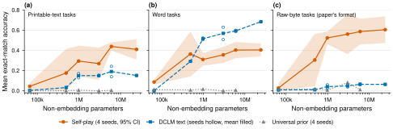
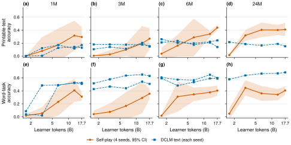
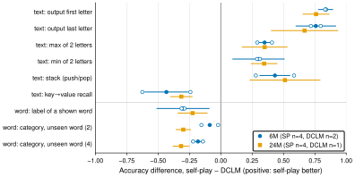
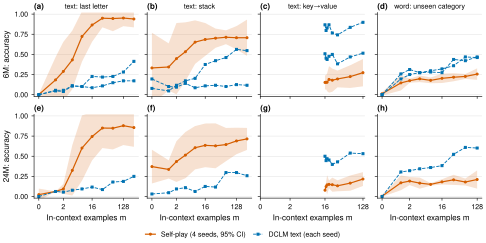
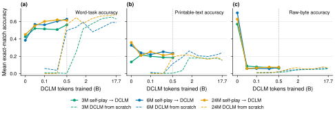

# Self-play vs. natural-text pretraining: what kind of in-context learning does each produce?

*A follow-up to "Self-Play Pretraining with Zero Data" (arXiv 2609.30063).
Experiments run 2026-09-27/28. All numbers come from `writeup/analysis.py`,
and all figures from `writeup/figs/*.py`.*

## Summary

The paper shows that transformers trained only on outputs of self-generated
programs develop in-context learning (ICL). It never compares that ICL with
what ordinary text pretraining produces. We ran that comparison on the paper's
own architecture and model sizes:
- **Self-play:** the paper's released checkpoints (100k–24M parameters, 4 seeds).
- **Text:** the same architecture trained on DCLM web text for the same number
  of learner tokens (up to 17.7B, the paper's ICL checkpoint).
- **Tasks:** three ICL task formats.

The results:

1. **Self-play wins algorithmic ICL, and its lead grows with size.** On
   printable-text versions of the paper's tasks (copying by position,
   comparisons, stack tracking), the gap over text models goes from +0.12 at
   1M–3M parameters to +0.25 at 6M–24M. The growth is about +0.10 accuracy per
   decade of parameters (seed-bootstrap 95% CI [+0.03, +0.17]).
2. **Text pretraining wins lexical and semantic ICL, and its lead also grows
   with size.** DCLM models beat self-play by 0.19–0.28 on word tasks at every
   size from 1M (slope −0.05 per decade, CI [−0.09, −0.01]):
   - labelling a word by its category when that word never appeared in the
     examples
   - key→value lookup of words or letters

   Self-play is at chance on the semantic tasks, as expected: it has never seen
   language.
3. **The paper's own ICL evaluation cannot answer the comparison.** In its
   raw-byte format, text models score about 0.02 even on trivial copying. The
   format is foreign to them, so the paper's Fig. 4 mostly measures format
   familiarity.
4. **ICL is decoupled from language-modelling loss.**
   - Text models improve steadily at predicting text (2.50 → 1.35 bits/byte
     from 100k to 24M), yet their algorithmic ICL stays flat at 0.15–0.19.
   - Self-play models barely predict text at all (6.2–7.6 bits/byte zero-shot),
     yet have the strongest algorithmic ICL.
5. **Self-play pretraining speeds up the acquisition of word-level ICL during
   text training.** After 0.5B text tokens, a model started from a self-play
   checkpoint is ahead of text-from-scratch at every size. Scratch training needs
   about 2× more tokens to catch up at 24M and roughly 6–13× more at 1M–3M. The
   self-play model's raw-byte skills vanish within 50M tokens.

Our reading: self-play and text pretraining teach different parts of in-context
learning. Self-play teaches **procedures** (position, order, comparison, state
tracking). Text teaches **retrieval and meaning** (binding a key to a value,
using what a word means). This refines the paper's claim that self-play
"develops in-context learning". It also fits the paper's own split between
*universal structure* and *contingent information*, with one exception worth
following up: text also wins at pure lookup, which needs no world knowledge.

---

## 1. Background: what the paper showed and what it left open

The paper trains a *learner* transformer on byte sequences produced by programs
that a *generator* writes. The generator runs in a small Turing-complete
language and is rewarded for programs that move the learner in a useful
direction. No natural data is used. The paper reports:
- Zero-shot prediction of text, images, audio and code improves as a power law
  in self-play compute.
- A 24M self-play learner shows ICL on six algorithmic tasks: reverse string,
  stack, associative recall, sum, max and min (the paper's Fig. 4).
- A non-adaptive "universal prior" baseline (random programs) does not.

**What the paper did not test:**
- **No natural-data baseline for ICL.** Its Fig. 4 compares self-play only
  against other synthetic data (a universal prior and random grammars). It
  never compares against ordinary pretraining on text. The paper does train
  24M models on DCLM (its Fig. 6), but only reports how fast they learn text,
  not their ICL.
- **No ICL scaling.** ICL is evaluated at one model size (24M) and one
  checkpoint (round 2816).
- **A single task format.** Every ICL task uses raw bytes 1–255 with a 0
  separator, which is natural for a model trained on program outputs and
  unnatural for a model trained on text.

## 2. Setup

| | Self-play (SP) | DCLM text | Universal prior (UP) | SP → DCLM |
|---|---|---|---|---|
| Source | Paper's released learners | Trained here | Paper's released learners | Trained here |
| Sizes | 100k, 500k, 1M, 3M, 6M, 24M | same six | 100k–6M (24M not released) | same six |
| Seeds | 4 | 2 at 1M/3M/6M, 1 otherwise | 4 | 1 |
| Tokens | 7 checkpoints, 1.6B → 51.5B | 9 checkpoints, 0.1B → 17.7B | 7 checkpoints | +0.05 → 0.5B |

**Model and training setup:**
- **Architecture:** identical across arms. It is the paper's byte-level
  Llama-style transformer: 4096-byte context, input prefixed with the byte `O`.
- **DCLM training:** AdamW, batch of 64 × 4096 bytes, 2% warmup then constant
  LR, bf16. The LR was chosen per size by a 3-point sweep on 0.3–0.5B tokens.
  Each run saves checkpoints at the exact token counts of the self-play rounds
  256/512/1024/2048/2816 (1.6/3.2/6.4/12.9/17.7B).
- **Training data:** disjoint from the evaluation text.
- **Warm starts:** start from the self-play round-8191 checkpoint, LR 3e-3 (the
  paper's tuned warm-start value).

**Comparison axis.** We compare at matched **learner tokens**, the paper's own
compute accounting. This favours self-play: its true cost also includes the
generator, which is the same size as the learner, plus its RL update. §4.4
checks how much this matters.

### Three ICL task suites

Every task gives the model *m* worked examples, then a new input, and scores
the most likely next byte (greedy, exact match; no sampling or fine-tuning).

| Suite | Format | Tasks | Why |
|---|---|---|---|
| **Raw bytes** | The paper's harness, ported byte-exactly: random bytes 1–255, byte 0 between examples | reverse, stack, associative recall, sum, max, min, first, last | Reproduces the paper's Fig. 4 |
| **Printable text** (new) | `\n<input>=<answer>` in lowercase letters and digits, e.g. `\nqd=q`, `\n+a+b-b-` → `a` | the same families, plus a letter cipher | Tests the same abilities in a format a text model can read |
| **Words** (new) | real English words, e.g. `\ncat=t\nmouth=b\nrabbit=` → `t` | category classification with 2 or 4 arbitrary labels, query word *unseen* in the examples; lookup of a *seen* word; word-order reversal | Tests ICL that needs, or benefits from, knowing language |

- **Scoring of multi-byte answers:** in the printable and word suites, a
  multi-byte answer counts only if every byte is right. The raw reverse task
  uses per-byte accuracy, as in the paper.
- **Headline scores** average each suite's tasks at m = 32–128.
- **Word-suite headline** covers the three classification/lookup tasks only.
  Word-order reversal is 0 for every model at every size, so it is reported
  separately rather than diluting the score.

### Validation

- **Prompt parity.** Our port of the paper's evaluation code generates exactly
  the paper's prompts: all 68,000 of them, checked by running the original
  scripts against a recording stub.
- **Figure 4 reproduction.** Scoring the paper's 24M round-2816 ensemble
  reproduces its Fig. 4 numbers with mean |Δ| = 0.002 and no bias (+0.0001) over
  310 cells. The largest single difference is 2 of 64 trials, consistent with
  kernel-level numerical noise.
- **DCLM training is healthy.** Validation bits/byte falls monotonically with
  size (2.50 / 1.88 / 1.71 / 1.58 / 1.51 / 1.35 from 100k to 24M), and the two
  seeds at a size agree within 0.01.

## 3. Results

### 3.1 The paper's format cannot compare against a text model

On the raw-byte suite, self-play beats DCLM by about 0.5 at every size from 1M
(Fig. 1c):

| Size | Self-play | DCLM |
|---|---|---|
| 1M | 0.52 | 0.02, 0.06 |
| 24M | 0.61 | 0.06 |

Most of this is format rather than ability. DCLM scores 0.02–0.05 on "output
the **first** input byte", which self-play solves at 1.00. The same DCLM models
do far better on the same abilities once the tasks are written as text (§3.2).
**Any comparison of ICL across pretraining data has to use a format that is
native to both models.**

**Figure 1. Self-play leads on algorithmic ICL and text leads on word ICL, and
both leads grow with model size.** Mean exact-match accuracy at 17.7B learner
tokens (the paper's ICL checkpoint) against non-embedding parameters.
- **Self-play:** 4 released seeds; the band is the 95% t-interval.
- **DCLM:** each seed hollow, mean filled; 2 seeds at 1M/3M/6M, 1 otherwise.
- **Universal prior:** 4 seeds at round 2816; not released at 24M.
- **(a)** Printable-text versions of the paper's tasks. **(b)** Word tasks,
  with word-order reversal (0 for all models) excluded. **(c)** The paper's
  raw-byte tasks.

### 3.2 Algorithmic ICL: self-play leads, and the lead grows with scale

Printable-text suite, 17.7B tokens:

| Size | Self-play (95% CI) | DCLM seeds | SP − DCLM | All DCLM seeds outside SP CI? |
|---|---|---|---|---|
| 100k | 0.044 ± 0.035 | 0.003 | +0.04 | yes |
| 500k | 0.18 ± 0.24 | 0.03 | +0.14 | no |
| 1M | 0.30 ± 0.15 | 0.17, 0.13 | +0.15 | no |
| 3M | 0.27 ± 0.16 | 0.15, 0.15 | +0.12 | no |
| 6M | **0.44 ± 0.04** | 0.24, 0.14 | **+0.25** | **yes** |
| 24M | **0.41 ± 0.10** | 0.15 | **+0.26** | **yes** |

**The gap grows with size.** A linear fit of the gap against log parameters
(1M–24M) has slope +0.10 per decade. Its seed-bootstrap 95% CI is [+0.03, +0.17].

**DCLM's algorithmic ICL does not scale.** It sits at 0.15–0.19 from 1M to 24M
parameters, and over training it is flat from the first checkpoint (Fig. 2a–d).
Self-play's grows from 0.30 to 0.41–0.44.

**By task** (Fig. 3; 6M and 24M):
- **Self-play is far ahead on copying by position:** first/last letter,
  +0.67 to +0.84.
- **Self-play is ahead on stack tracking** (+0.43 to +0.51) and **on
  comparisons** (max/min, +0.30 to +0.35).
- **None of the models can do multi-digit addition, 8-letter reversal or the
  letter cipher at this scale.**

**Timing differs** (Fig. 2a–d): DCLM reaches its (low) level of algorithmic
ICL by the first matched checkpoint (1.6B tokens). Self-play starts lower and
overtakes it between 3B and 6B tokens.

**Figure 2. Text models get their ICL early and stop improving; self-play
keeps climbing on algorithmic tasks but never catches text on word tasks.**
Accuracy against learner tokens at the five token counts where self-play
checkpoints and DCLM checkpoints coincide (log scale).
- **Top row:** printable-text suite. **Bottom row:** word suite.
- **Self-play:** mean of 4 seeds with 95% t-interval.
- **DCLM:** each seed drawn separately.

### 3.3 Lexical and semantic ICL: text leads at every size from 1M up

Word suite, 17.7B tokens (classify-2, classify-4 and lookup-4 averaged):

| Size | Self-play (95% CI) | DCLM seeds | SP − DCLM |
|---|---|---|---|
| 1M | 0.31 ± 0.06 | 0.51, 0.52 | −0.21 |
| 3M | 0.36 ± 0.08 | 0.63, 0.51 | −0.21 |
| 6M | 0.40 ± 0.08 | 0.59, 0.60 | −0.19 |
| 24M | 0.41 ± 0.06 | 0.69 | **−0.28** |

- **Every DCLM seed lies above the self-play interval at every size from 1M,**
  and the gap widens with size (slope −0.05 per decade, CI [−0.09, −0.01]).
  Self-play's word score plateaus at about 0.40 from 6M on. DCLM's keeps rising
  (0.51 → 0.69).

**By task** (Fig. 3; figure 5d/h for the curves):
- **Categorising an unseen word:** self-play sits at or below chance (0.45–0.54
  with 2 labels at 6M/24M and 0.40 at 1M, chance ≈ 0.5; 0.19–0.22 with 4
  labels, chance ≈ 0.25). Without
  having seen language it cannot tell that "rabbit" goes with "cat". DCLM is
  clearly above chance (24M: 0.75 and 0.52).
- **Recalling the label of a word shown earlier** needs no world knowledge,
  only binding and retrieval. Self-play manages it (0.35–0.56, above the 0.25
  chance), but DCLM does better (0.68–0.78). The printable-text key→value task
  shows the same pattern (DCLM 0.48–0.71 vs self-play 0.19–0.27).

So text pretraining is not only supplying word meanings. It also builds
stronger retrieval (binding and recall) than self-play at these sizes.

**Figure 3. The two kinds of pretraining favour opposite tasks.** Self-play
minus DCLM accuracy per task at 17.7B learner tokens, 6M and 24M parameters.
- **Filled markers:** self-play mean (4 seeds) minus DCLM mean.
- **Whiskers:** 95% t-interval over the self-play seeds.
- **Hollow markers:** the difference against each individual DCLM seed (6M
  has 2 DCLM seeds; 24M has a single seed). A two-sample interval with 1–2 DCLM
  seeds has about one degree of freedom and is not shown.
- **Omitted:** tasks every model scores 0 on (multi-digit sum, 8-letter
  reverse, cipher, word-order reversal).

### 3.4 Both arms learn from the examples

Fig. 5 shows how accuracy changes with the number of examples m. With no
examples, both arms are near 0 on the new-format tasks. Both improve as m
grows. For example, at 24M:

| Task (24M) | Self-play: m=0 → m=256 | DCLM: m=0 → m=256 |
|---|---|---|
| Last letter | 0.02 → 0.86 | 0.00 → 0.25 |
| Unseen-word category | 0.00 → 0.21 (m=128) | 0.00 → 0.60 (m=128) |

So the differences are in how much each model learns from context, not in
built-in guesses.

Word lookup is the one curve that falls with m. With one example the query word
*is* the example; with more examples, more of them are distractors.

**Figure 5. Both models genuinely learn from their examples, with opposite
strengths.** Accuracy against the number of in-context examples m, at 17.7B
learner tokens.
- **Rows:** 6M and 24M.
- **Self-play:** 4 seeds with 95% t-interval. **DCLM:** each seed.
- **The key→value task** starts at m = 16, because the dictionary has 16 entries.

### 3.5 Self-play → text warm starts: word ICL arrives sooner, most at small sizes

Continuing text training from the final self-play checkpoint (Fig. 4):

**Word ICL arrives early.**

| Size | Warm start after 0.5B tokens | Scratch after 0.5B | Scratch first reaches the warm-start level at |
|---|---|---|---|
| 1M | 0.43 | 0.00 | 3.2–6.4B (~6–13×) |
| 3M | 0.56 | 0.00 | 3.2–12.9B (~6–25×; the two seeds differ) |
| 6M | 0.63 | 0.50 | never (peaks at 0.62; 0.60 by 1.6B) |
| 24M | 0.62 | 0.57 | 1.0B (~2×) |

Scratch values are the mean over DCLM seeds (2 at 1M/3M/6M). The advantage is
largest at small sizes, where scratch models pick up word ICL late (1M and 3M
scratch are still at 0.00 after 0.5B tokens). At 6M and 24M, scratch catches up
within 1–2B tokens and then plateaus, so the speed-up there is modest.

**Algorithmic ICL is partly kept.** Printable-text scores fall from 0.33–0.36 to
about 0.23 at 6M/24M, still at or above what scratch DCLM ever reaches (0.15–0.19).

**Raw-byte ICL is lost almost immediately** (0.57–0.70 → about 0.06 within 50M
tokens). Skills tied to the self-play format do not survive, while the
format-independent abilities transfer.

This extends the paper's Fig. 6, which showed that self-play initialisation
speeds up *loss* on text, to *ICL*.

**Figure 4. Starting from self-play gives text training its word ICL almost
immediately, and wipes out the raw-byte skills.** Headline accuracy against
DCLM training tokens.
- **Solid lines:** training from the final self-play checkpoint. The leftmost
  point is the self-play checkpoint itself (4-seed mean).
- **Dashed lines:** DCLM from scratch (seed 0).
- **The dotted line** marks 0.5B tokens, where warm starts stop.
- Single seed for both warm starts and scratch runs.

### 3.6 ICL is not a by-product of language-modelling loss

| Size | DCLM val. bits/byte (ours) | Self-play zero-shot bits/byte on DCLM (paper's scores) | Algorithmic ICL, SP / DCLM |
|---|---|---|---|
| 1M | 1.71, 1.70 | 6.76 | 0.29 / 0.15 |
| 6M | 1.51, 1.50 | 6.42 | 0.44 / 0.19 |
| 24M | 1.35 | 6.21 | 0.41 / 0.15 |

Text models become much better language models with scale while their
algorithmic ICL does not move. Self-play models are nearly clueless about text
(random guessing is 8 bits/byte), yet solve the printable-text tasks best.
Whatever self-play is teaching, it is not better text modelling.

### 3.7 Robustness checks

**Self-play ICL depends on the checkpoint and the seed.** Comparing the
paper's ICL checkpoint (round 2816) with the final one (round 8191), seed by seed:
- **Text suite:** the seed mean is lower at round 8191 for 1M–24M, but that comes
  from individual seeds dropping sharply (one 3M seed goes 0.38 → 0.08). Every 95%
  interval for the change includes zero.
- **Word and raw-byte suites:** several changes are significantly *positive*
  (500k word: +0.07 ± 0.03).

So self-play ICL is not monotonic in training and varies a lot between seeds.
The paper's single-checkpoint Fig. 4 is best read as one draw from that
distribution.

**The universal prior** shows no ICL on any suite at any size (≤ 0.08). This
replicates the paper's claim that the adaptive curriculum, not just "training on
programs", is what produces ICL.

**Compute handicap.** If self-play's true cost is about 2.75× its learner
tokens, the fair comparison is self-play at 6.4B tokens against DCLM at 17.7B.

| Size | Self-play @ 6.4B | DCLM @ 17.7B | Holds? |
|---|---|---|---|
| 24M | 0.41 | 0.15 | Yes, clearly |
| 6M | 0.29 (CI ±0.29) | 0.14–0.24 | Uncertain |
| 1M–3M | – | – | No: self-play is not ahead |

So "self-play gives more algorithmic ICL per unit of compute" is supported only
at the largest size under this handicap. The size trend points the right way,
but the claim needs larger models to confirm.

## 4. Significance and novelty relative to the paper

1. **It supplies the missing control.** The paper's central ICL result had no
   natural-data baseline. With one, the result is more specific than
   "self-play develops ICL": self-play develops *more algorithmic ICL than
   text* at matched tokens, but *less lexical/retrieval ICL*. This is the first
   head-to-head of the two on the same architecture and token budget.
2. **It shows a scaling divergence.** The paper measured ICL at one size. Across
   its ladder, the two kinds of pretraining pull apart as models grow:
   - **Self-play's lead** on algorithmic tasks: about +0.10 per decade of
     parameters.
   - **Text's lead** on word tasks: about +0.05 per decade.

   Neither looks like it will absorb the other at this range.
3. **It identifies an evaluation confound.** The paper's ICL format cannot be
   used to compare against text models: they fail even trivial copying in it.
   The printable-text and word suites are reusable, fairer probes for this line
   of work.
4. **It connects to the paper's theory, and refines it.** The paper splits what
   pretraining teaches into *universal structure* (learnable from computation)
   and *contingent information* (facts about our world).
   - **Consistent with the theory:** self-play wins where the task needs only
     structure (procedures). Text wins where it needs contingent knowledge
     (word meanings).
   - **The unexpected part:** text also wins *pure* retrieval (key→value, word
     lookup), which needs no contingent knowledge. Either the paper's self-play
     curriculum under-samples binding and retrieval, or natural text is a
     particularly rich source of that universal structure. A retrieval-heavy
     self-play reward would be a direct test.
5. **It extends pre-pretraining from loss to ICL.** The paper showed that
   self-play initialisation speeds up learning of text loss. We show it also
   speeds up word-level ICL: roughly 6–13× fewer text tokens at 1M–3M, and 2×
   at 24M. We also show which skills transfer (format-independent ones) and
   which are discarded (the raw-byte ones).
6. **It shows that ICL and language-modelling loss come apart.** The two
   pretraining sources rank models in opposite orders on text loss and on
   algorithmic ICL. That supports treating ICL "mechanisms" as trainable
   separately from world knowledge, which is the premise of self-play
   pre-pretraining.

## 5. Limitations

- **Scale.** Models are ≤ 24M parameters (the paper's range). Trends across 1.4
  decades of parameters (1M–24M; 2.6 decades including 100k), with 4–6
  points, are not scaling laws.
- **Seeds.**
  - Self-play has 4 seeds, and its seed spread is large at 500k–3M (CI ±0.15).
    That is why the 1M/3M gaps are not individually significant.
  - DCLM has 2 seeds at 1M/3M/6M and 1 at 100k/500k/24M. DCLM's printable-text
    score varies between seeds (0.24 vs 0.14 at 6M); its word score does not.
- **Scoring.** Greedy exact match over all 256 bytes penalises a model that is
  unsure of the *output format* as much as one that cannot do the task. Text
  models may partly "know" the answer to first/last-letter tasks but put mass
  on other characters. Restricted-choice or log-probability scoring would
  separate the two. The per-token probabilities were not saved.
- **Compute accounting.** The comparison matches learner tokens. Self-play's
  generator cost is not measured here; §3.7 gives a sensitivity check.
- **Training choices.**
  - **LR:** DCLM LRs were picked by short sweeps, and three sizes chose an
    edge of their grid.
  - **Schedule:** constant LR without cooldown, for both arms' checkpoints.
  - **Warm-start LR:** warm starts use a higher LR (3e-3, the paper's value)
    than the scratch runs.
- **Task design.** The printable and word tasks are ours: 10 word categories of
  20 common words, and specific formats. They cover a narrow slice of what
  "ICL" means in practice (no instruction following or real few-shot NLP tasks).

## 6. What would strengthen or overturn this

- **Larger models (100M–1B).** Does the algorithmic gap keep growing, and does
  it survive a measured compute-matched comparison?
- **Log-probability scoring** of candidate answers, to separate format
  adherence from task ability for text models.
- **More DCLM seeds** at 24M, and more self-play seeds at 500k–3M.
- **Mixing curricula.** Interleaved self-play and text, to test whether the two
  kinds of ICL are complementary. The warm-start results suggest they are.
- **A retrieval-focused self-play reward,** to test whether text's retrieval
  advantage is a gap in the curriculum or a property of natural data.

## 7. Reproducibility

| What | Where |
|---|---|
| Measured training throughput (A100, RTX 6000 Ada, A6000; packing test) | `icl_compare/results/bench*.jsonl` |
| Harness (verbatim port + new suites), trainer, pipeline | `icl_compare/` (`icl/tasks.py`, `train.py`, `run_all.py`) |
| Prompt-parity test / Fig. 4 reproduction | `icl_compare/tests/test_prompt_parity.py`, `icl_compare/icl/check_repro.py` |
| Every checkpoint (DCLM + warm starts), training logs | Hugging Face [`rihim/icl-selfplay-vs-text-checkpoints`](https://huggingface.co/rihim/icl-selfplay-vs-text-checkpoints) |
| Every ICL result file, tidy CSVs, LR-sweep logs | Hugging Face [`rihim/icl-selfplay-vs-text-results`](https://huggingface.co/datasets/rihim/icl-selfplay-vs-text-results) |
| Tables and statistics | `writeup/figs/extract.py` → `writeup/analysis.py` → `writeup/analysis_out.md` |
| Figures | `writeup/figs/fig*.py` (PDF + SVG) |

**Compute:** a single A100 80GB SXM4 (Prime Intellect, $1.23/h), 29.5 hours, $36.
That covers the LR sweeps, 11 DCLM runs to 17.7B tokens, 6 warm starts, and ICL
evaluation of 179 checkpoint groups (152 scored on the raw + printable and word suites, plus 27 extra-seed checkpoints on all three; 331 result files).
